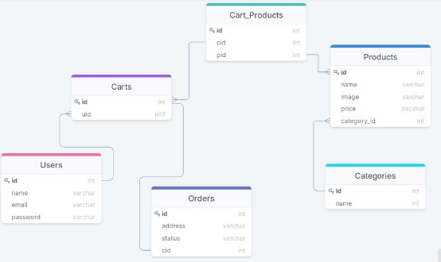
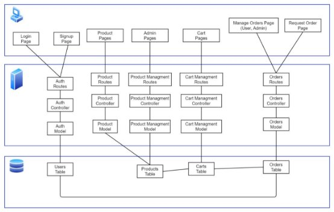
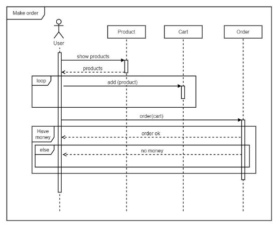
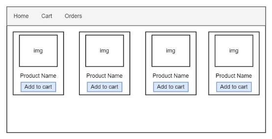
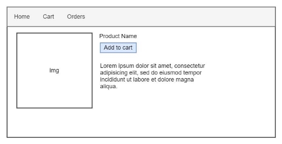
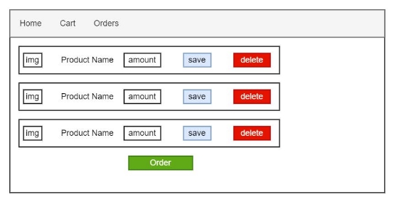
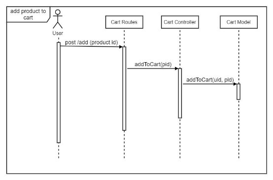
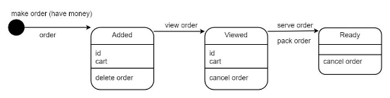
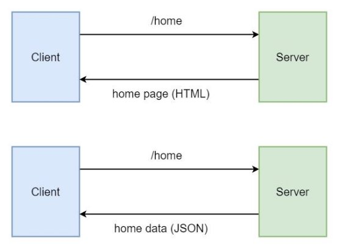

**Software Development Process**

1. Business Analysis   Roles, Scopes, Requirements
1. Database Design
1. Conceptual Design   ERD, EERD
1. Logical Design   Data Model

i. SQL

ii. NoSQL

1. Key-Value based
1. Column Oriented
1. Document Oriented
1. Graph-based

c. Physical Design

3. High Level Design / Software Architecture   Component Diagram, Activity Diagram, Sequence Diagram
3. Low Level Design
   1. UX,UI Design   Pages & Layouts
   1. Software Design   Class Diagram, Sequence Diagram, State Diagram
3. Implementation
3. Testing
3. Deployment

**Business Analysis**

1. Business Roles
- Anonymous users can show products
- Products can be filtered by category
- Only Registered users can add products to cart
- User can view and modify his cart
- Only Registered users can make orders
- Registered users can see their orders and track their status
- Admins can add products
- Admin can update/delete products he added
- Admins can view and manage all users' orders
2. Business Scopes
- Admin
  - Add product
  - Modify/delete products he add
  - Manage users orders
- Registered Users
  - View & filter products
  - Add products to cart
  - Manage cart
  - Make orders
  - Track orders
- Anonymous Users

o View & filter products

3. Functional Requirements

|ID|Requirement|Description|Priority|
| - | - | - | - |
|FR001|Registration|Users can register to the system|MUST|

|FR002|View & Filter Products|Registered and Anonymous users can view products|MUST|
| - | :- | :- | - |
|FR003|Cart|Registered user can add products to cart and manage his cart|MUST|
|FR004|Order|Registered user can make order and track its status|MUST|
|FR005|Manage Products|Admins can add and manage products|MUST|
|FR006|Manage Orders|Admins can view and manage users orders|MUST|
**Database Design**

4. Database Design

**High Level Design**

5. Component Diagram

6. Activity Diagrams

7. Sequence Diagrams

**Low Level Design**

8. UX & UI Designs

9. Sequence Diagrams

10. State Diagrams

**Implementation**

- **Database**

decide from ERD which database to use

if you have a lot of many-to-many relationships and need to make complex joins, you should consider relational databases (sql database) (like MySQL, PostgreSQL, SQL Server, Oracle)

if you need dynamic schemas (no specific attributes), you should consider nosql databases

if you need simple and fast database (cache for example), consider key-value based databases (like Redis)

if you need to make analysis on specific attributes, consider column-oriented databases (like Cassandra)

if you have simple relations (one-to-one, one-to-many), consider document-oriented databases (like MongoDB, CouchDB)

if you have big data and complex relations, consider graph-based databases (Neo4J)

- **Backend (Web)**

if you want real-time communications, consider NodeJS

if your application is CPU intensive (make complex operations and calculations), consider multithreaded languages (like Java, C#, PHP)

if your project needs AI tasks, consider Python

for small and some medium projects, any language and framework will be OK

- **Frontend (Web)**

using frameworks (Angular, React, Vue) may be overkill and adding extra complexity to the project (ex: API)

React is suitable for small to medium applications. it has fewer built-in features (making components) and needs additional libraries. it does not have a specific folder structure.

Angular is suitable for large applications. it has almost all the features you need (components, routing, http, forms, animations,…...). it has a specific folder structure

Vue is something between React and Angular.

**Testing**

- **Unit testing**

Test every function and only one function

- **Integrated Testing**

Test a set of functions together

- **End-to-End (e2e) Testing**

Test the entire application from the start to end

**Deployment**

Making executable file or Deploy web app to host

**API**

a software used by another software

- **Web API**

Endpoint = HTTP method + route

GET /home

POST /cart

PUT /cart

DELETE /cart

- **REST API**

REpresentational State Transfer

**Softwares**

[https://draw.io/ ](https://draw.io/)<https://drawsql.app/>

MySQL Workbench

Pencil [https://pencil.evolus.vn/ ](https://pencil.evolus.vn/)AdobeXD

Figma <https://www.figma.com/>
